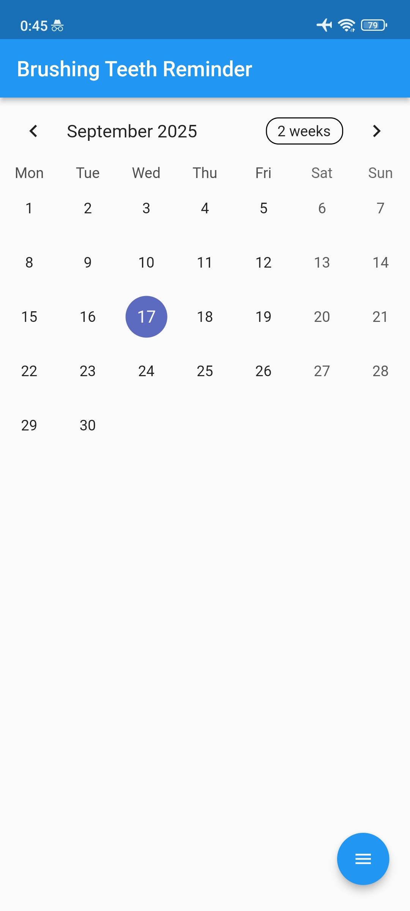

<p align="center">
  <a href="#">
    
  </a>
</p>

<h1 align="center">Brushing Teeth Reminder</h1>

<p align="center">
  Aplikasi Flutter pengingat sikat gigi dengan notifikasi terjadwal harian.
  <br/>
  <a href="#penggunaan"><strong>Lihat cara penggunaan »</strong></a>
  <br/>
  <br/>
  <a href="#instalasi">Instalasi</a>
  ·
  <a href="#kontribusi">Kontribusi</a>
  ·
  <a href="#lisensi">Lisensi</a>
</p>

---

## Daftar Isi
- [Deskripsi](#deskripsi)
- [Fitur](#fitur)
- [Tech Stack](#tech-stack)
- [Instalasi](#instalasi)
  - [Prasyarat](#1-prasyarat)
  - [Persiapan SDK Android](#2-persiapan-sdk-android)
  - [Clone & Dependensi](#3-clone--dependensi)
  - [Konfigurasi](#4-konfigurasi)
  - [Jalankan Lokal](#5-jalankan-lokal)
- [Penggunaan](#penggunaan)
- [Tangkapan Layar](#tangkapan-layar)
- [Struktur Proyek](#struktur-proyek)
- [Troubleshooting](#troubleshooting)
- [Kontribusi](#kontribusi)
- [Lisensi](#lisensi)

## Deskripsi
<p align="center">
  
</p>
Pengingat sikat gigi dua kali sehari. Aplikasi akan menjadwalkan notifikasi lokal pagi dan malam. Tersedia penjadwal kustom, suara notifikasi, serta pengaturan auto-start di Android yang didukung.

## Fitur
- Pengingat harian (pagi/malam) via notifikasi lokal
- Penjadwalan fleksibel dengan `flutter_local_notifications`
- Simpan preferensi pengguna (jam, enable/disable)
- Dukungan Android, iOS, Web, dan Desktop (dev)

## Tech Stack
<p>
  <a href="https://flutter.dev/"></a>
  <a href="https://dart.dev/"></a>
  <a href="https://developer.android.com/studio"></a>
</p>

## Instalasi
### 1) Prasyarat
- Flutter SDK 3.x (telah diuji pada 3.10.6)
- Android Studio 2022.3+ dan Android SDK
- Xcode (opsional, untuk iOS/macOS)

### 2) Persiapan SDK Android
Di Android Studio → Settings → Android SDK:
- Tab SDK Tools: centang Command-line Tools (latest), Platform-Tools, Emulator
- Tab SDK Platforms: centang Android 14 (API 34)

Tambahkan repository JitPack (sudah dikonfigurasi di proyek pada `android/build.gradle`).

### 3) Clone & Dependensi
```bash
git clone https://github.com/<your-username>/brushing_teeth_reminder.git
cd brushing_teeth_reminder
flutter pub get
```

### 4) Konfigurasi
- Tidak ada konfigurasi wajib. Opsi jam default dapat diubah di UI.
- Untuk iOS/macOS, pastikan CocoaPods terpasang dan jalankan `cd ios && pod install` (opsional bila build iOS).

### 5) Jalankan Lokal
#### Via Android Studio
1. File → Open → pilih folder proyek ini
2. Tools → Device Manager → buat/jalankan AVD (Android 14)
3. Pilih device di toolbar → Run ▶

#### Via Terminal
```bash
export PATH="$HOME/flutter/bin:$PATH"
cd /Users/<kamu>/projects/brushing_teeth_reminder
flutter devices
flutter run -d <device_id>
```

## Penggunaan
- Atur jadwal pengingat pagi/malam di halaman utama
- Aktifkan notifikasi; aplikasi akan menjadwalkan alarm lokal
- Ubah jam kapan saja; jadwal akan diperbarui

## Struktur Proyek
```
lib/
  main.dart
  home_page.dart
  notification.dart
  scanner.dart
  buttonrama.dart
  Services/
    notifi_service.dart
android/
ios/
... (platform lain)
```

## Troubleshooting
- Missing cmdline-tools / Android licenses: jalankan `flutter doctor -v` dan `flutter doctor --android-licenses`
- Tidak ada device: nyalakan emulator dari Device Manager atau gunakan `flutter devices`
- Gagal resolve dependency `autostarter`: proyek sudah menambahkan JitPack di `android/build.gradle`
- Cache bermasalah: `flutter clean && flutter pub get`

## Kontribusi
1. Fork repo, buat branch fitur
2. Commit dengan pesan yang jelas
3. Buka Pull Request

## Lisensi
MIT License
